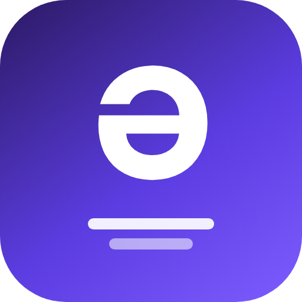

<div align="center">



# Azərbaycan Altyazılar

**Stremio üçün Azərbaycan dilində altyazı əlavəsi**
<br>
*Azerbaijani subtitles for Stremio*

<br>

### [➜ Quraşdır / Install](https://stremio-subtitle-addon-mvrad-digital.muradismayilovvlog.workers.dev)

`https://stremio-subtitle-addon-mvrad-digital.muradismayilovvlog.workers.dev/manifest.json`

<br>

**[🇦🇿 Azərbaycanca](#-azərbaycanca)** · **[🇬🇧 English](#-english)**

</div>

---

## 🇦🇿 Azərbaycanca

### Bu nədir?

Stremio-ya bir dəfə quraşdırdığınız altyazı əlavəsidir. Quraşdırdıqdan sonra
film və ya serial baxarkən altyazı menyusunda **«Azərbaycan dili»** variantı
görünür — sadəcə seçirsiniz.

Nə fayl axtarmaq, nə yükləmək, nə də hər dəfə əl ilə altyazı əlavə etmək lazım
deyil. Bir dəfə quraşdırırsınız və unudursunuz.

> **Qeyd:** Bu əlavə film və ya video **yayımlamır** — yalnız altyazı verir.
> Filmləri həmişəki kimi Stremio-da baxırsınız.

**Pulsuzdur.** Qeydiyyat, abunə və ya ödəniş tələb olunmur.

<br>

### Necə quraşdırılır?

<details open>
<summary><b>💻 Kompüter — Windows, macOS, Linux</b></summary>

<br>

1. Stremio proqramını açın
2. Yuxarı sağdakı **puzzle** ikonuna basın — **Addons** bölməsi açılacaq
3. Səhifənin yuxarısındakı **Addon Repository URL** sahəsinə bu ünvanı yapışdırın:
   ```
   https://stremio-subtitle-addon-mvrad-digital.muradismayilovvlog.workers.dev/manifest.json
   ```
4. **Install** düyməsinə basın

**Daha asan yol:** [bu səhifəni](https://stremio-subtitle-addon-mvrad-digital.muradismayilovvlog.workers.dev)
açıb **«Stremio-ya əlavə et»** düyməsinə basın — proqram özü açılır.

</details>

<details>
<summary><b>📱 Android telefon və Android TV</b></summary>

<br>

1. Stremio tətbiqini açın
2. Sol menyudan **Addons** bölməsinə keçin
3. Yuxarıdakı ünvan sahəsinə linki yazın və **Install** basın

> **Televizor üçün məsləhət:** pultla uzun link yazmaq əziyyətdir.
> Kompüterdə və ya telefonda **eyni Stremio hesabına** daxil olub quraşdırın —
> əlavə televizorda avtomatik görünəcək.
>
> Qonaq (guest) rejimində sinxronizasiya işləmir, ona görə e-poçt ilə hesab
> yaradın.

</details>

<details>
<summary><b>🍎 iPhone və iPad</b></summary>

<br>

App Store-da tam funksiyalı Stremio tətbiqi yoxdur — iOS-da Stremio brauzer
versiyası ilə istifadə olunur.

1. **Safari**-də `web.stremio.com` ünvanını açın
2. **Paylaş** → **Ana ekrana əlavə et** — tətbiq kimi işləyəcək
3. Hesabınıza daxil olun
4. **Addons** → ünvanı yapışdırın → **Install**

</details>

<details>
<summary><b>🌐 Brauzer</b></summary>

<br>

1. `web.stremio.com` ünvanını açın
2. Hesabınıza daxil olun
3. **Addons** bölməsində ünvanı yapışdırın və **Install** basın

</details>

<br>

### Altyazını necə açmaq olar?

Quraşdırdıqdan sonra ən çox verilən sual budur.

| | |
|---|---|
| **1** | Filmi və ya serialı **oynadın** — baxış başlasın |
| **2** | Ekranın aşağısındakı **altyazı (CC)** ikonuna toxunun |
| **3** | Siyahıdan **Azərbaycan dili** seçin |

> ⚠️ Altyazı siyahısı yalnız **film oynamağa başlayandan sonra** görünür —
> filmin təsvir səhifəsində yox. Bu, Stremio-nun iş prinsipidir.

<br>

### Suallar

<details>
<summary><b>Altyazı görünmür, nə edim?</b></summary>

<br>

Əvvəlcə filmi oynadın — altyazı menyusu yalnız baxış başlayandan sonra aktiv
olur. Hələ də yoxdursa, deməli bu film hələ kolleksiyaya əlavə olunmayıb.
Stremio-nu bağlayıb yenidən açmaq da bəzən kömək edir.

</details>

<details>
<summary><b>Pulludur?</b></summary>

<br>

Xeyr. Tamamilə pulsuzdur — qeydiyyat, abunə və ya ödəniş yoxdur.

</details>

<details>
<summary><b>Hansı filmlər var?</b></summary>

<br>

Cari siyahını [əlavənin səhifəsində](https://stremio-subtitle-addon-mvrad-digital.muradismayilovvlog.workers.dev)
görə bilərsiniz. Kolleksiya mütəmadi genişlənir.

</details>

<details>
<summary><b>Altyazı filmdən tez və ya gec gedir</b></summary>

<br>

Bu, altyazının deyil, videonun fərqli versiyasından olur. Stremio-da baxış
zamanı altyazı parametrlərində **gecikmə (delay)** ayarını irəli-geri
sürüşdürərək uyğunlaşdıra bilərsiniz.

</details>

<details>
<summary><b>Hərflər düzgün görünmür (ə, ğ, ş, ı)</b></summary>

<br>

Bütün altyazılar UTF-8 formatındadır, ona görə Azərbaycan hərfləri düzgün
görünməlidir. Problem varsa, Stremio-nun altyazı parametrlərində şrifti
dəyişməyi yoxlayın.

</details>

<details>
<summary><b>Əlavəni necə silmək olar?</b></summary>

<br>

Stremio → **Addons** → **My Addons** → əlavənin yanındakı **Uninstall**.

</details>

<br>

### Dəstəklənən cihazlar

| Cihaz | Vəziyyət |
|---|---|
| Windows · macOS · Linux | ✅ Tam işləyir |
| Android telefon və planşet | ✅ Tam işləyir |
| Android TV · Google TV | ✅ Tam işləyir |
| Brauzer (web.stremio.com) | ✅ Tam işləyir |
| iPhone · iPad | ✅ Brauzer versiyası ilə |

<br>

---

## 🇬🇧 English

### What is this?

A subtitle addon for Stremio. You install it once, and from then on every film
and series you watch shows **"Azərbaycan dili"** in the subtitle menu — you
just pick it.

No hunting for files, no downloading, no adding subtitles by hand each time.
Install it once and forget it.

> **Note:** This addon does **not** stream films or video — it only provides
> subtitles. You watch films in Stremio exactly as you always have.

**It's free.** No account, no subscription, no payment.

<br>

### How to install

<details open>
<summary><b>💻 Computer — Windows, macOS, Linux</b></summary>

<br>

1. Open Stremio
2. Click the **puzzle** icon in the top right to open **Addons**
3. Paste this address into the **Addon Repository URL** field at the top:
   ```
   https://stremio-subtitle-addon-mvrad-digital.muradismayilovvlog.workers.dev/manifest.json
   ```
4. Click **Install**

**Easier:** open [the addon page](https://stremio-subtitle-addon-mvrad-digital.muradismayilovvlog.workers.dev)
and press **"Stremio-ya əlavə et"** — Stremio opens by itself.

</details>

<details>
<summary><b>📱 Android phone and Android TV</b></summary>

<br>

1. Open the Stremio app
2. Go to **Addons** in the left menu
3. Enter the address in the field at the top and press **Install**

> **Tip for TV:** typing a long URL with a remote is painful. Install it on a
> computer or phone while signed into the **same Stremio account** — it will
> appear on the TV automatically.
>
> Sync does not work in guest mode, so create an account with an email address.

</details>

<details>
<summary><b>🍎 iPhone and iPad</b></summary>

<br>

There is no fully featured Stremio app on the App Store — on iOS, Stremio is
used through the browser.

1. Open `web.stremio.com` in **Safari**
2. **Share** → **Add to Home Screen** — it then behaves like an app
3. Sign in to your account
4. **Addons** → paste the address → **Install**

</details>

<details>
<summary><b>🌐 Browser</b></summary>

<br>

1. Open `web.stremio.com`
2. Sign in to your account
3. Paste the address under **Addons** and press **Install**

</details>

<br>

### How to turn subtitles on

This is the question everyone asks after installing.

| | |
|---|---|
| **1** | **Start playing** the film or episode |
| **2** | Tap the **subtitle (CC)** icon at the bottom of the screen |
| **3** | Choose **Azərbaycan dili** from the list |

> ⚠️ The subtitle list only appears **once playback has started** — not on the
> film's detail page. That is simply how Stremio works.

<br>

### FAQ

<details>
<summary><b>No subtitles are showing</b></summary>

<br>

Start playing the film first — the subtitle menu is only active during
playback. If it is still not there, that film has not been added to the
collection yet. Restarting Stremio sometimes helps too.

</details>

<details>
<summary><b>Does it cost anything?</b></summary>

<br>

No. It is completely free — no account, no subscription, no payment.

</details>

<details>
<summary><b>Which films are included?</b></summary>

<br>

You can see the current list on
[the addon's page](https://stremio-subtitle-addon-mvrad-digital.muradismayilovvlog.workers.dev).
The collection grows regularly.

</details>

<details>
<summary><b>Subtitles are out of sync</b></summary>

<br>

That comes from a different version of the video file, not from the subtitle.
While watching, open the subtitle settings in Stremio and adjust the **delay**
slider forwards or backwards until it lines up.

</details>

<details>
<summary><b>Letters look wrong (ə, ğ, ş, ı)</b></summary>

<br>

All subtitles are UTF-8, so Azerbaijani letters should display correctly. If
something still looks off, try changing the font in Stremio's subtitle
settings.

</details>

<details>
<summary><b>How do I remove the addon?</b></summary>

<br>

Stremio → **Addons** → **My Addons** → **Uninstall** next to the addon.

</details>

<br>

### Supported devices

| Device | Status |
|---|---|
| Windows · macOS · Linux | ✅ Fully supported |
| Android phone and tablet | ✅ Fully supported |
| Android TV · Google TV | ✅ Fully supported |
| Browser (web.stremio.com) | ✅ Fully supported |
| iPhone · iPad | ✅ Via the browser version |

<br>

---

<div align="center">

**Mvrad Digital**

<sub>Stremio is a trademark of Smart Code Ltd. This addon is not affiliated with Stremio.</sub>

</div>
